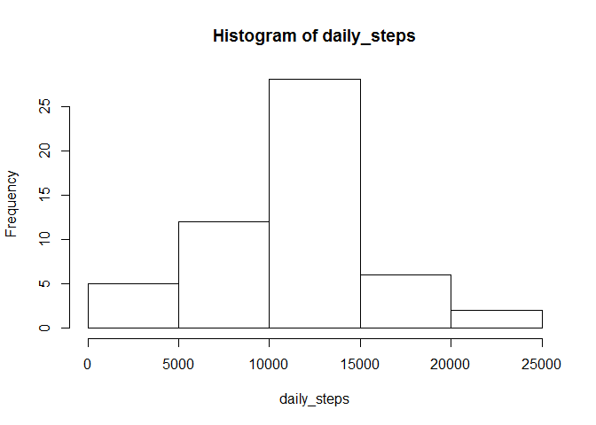
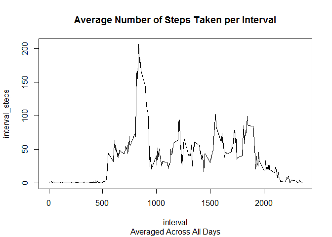
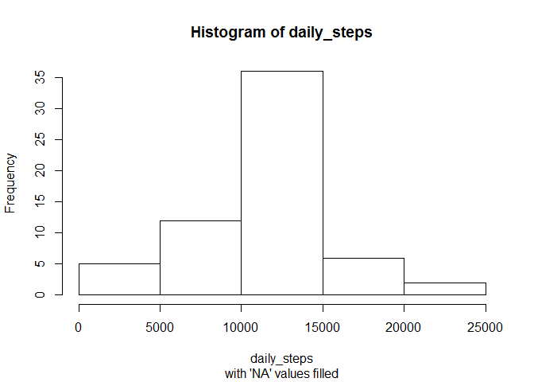
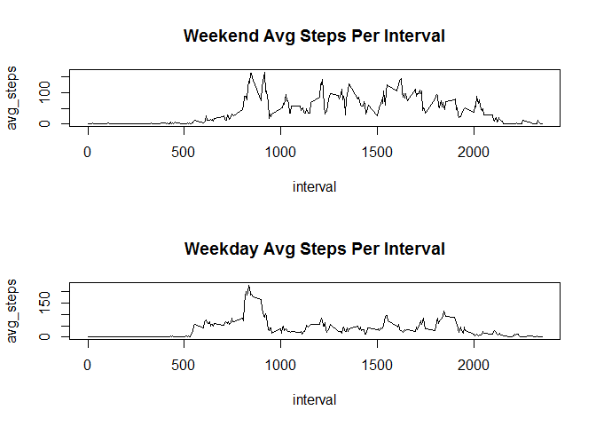

# Reproducible Research: Peer Assessment 1 - Steve Ruttenberg


## Loading and preprocessing the data

Load package to use 'tibbles' and work in the 'tidyverse' (see: "http://r4ds.had.co.nz/tibbles.html")

```r
library(tidyverse, quietly = TRUE, warn.conflicts = FALSE)
```

```
## Warning: package 'tidyverse' was built under R version 3.3.2
```

```
## Loading tidyverse: ggplot2
## Loading tidyverse: tibble
## Loading tidyverse: tidyr
## Loading tidyverse: readr
## Loading tidyverse: purrr
## Loading tidyverse: dplyr
```

```
## Warning: package 'ggplot2' was built under R version 3.3.2
```

```
## Warning: package 'tibble' was built under R version 3.3.2
```

```
## Warning: package 'tidyr' was built under R version 3.3.2
```

```
## Warning: package 'readr' was built under R version 3.3.2
```

```
## Warning: package 'purrr' was built under R version 3.3.2
```

```
## Warning: package 'dplyr' was built under R version 3.3.2
```

```
## Conflicts with tidy packages ----------------------------------------------
```

```
## filter(): dplyr, stats
## lag():    dplyr, stats
```

Unzipping, reading in data and viewing:

```r
unzip("activity.zip")
activity <- as_tibble(read.csv("activity.csv", stringsAsFactors = FALSE))
activity
```

```
## # A tibble: 17,568 × 3
##    steps       date interval
##    <int>      <chr>    <int>
## 1     NA 2012-10-01        0
## 2     NA 2012-10-01        5
## 3     NA 2012-10-01       10
## 4     NA 2012-10-01       15
## 5     NA 2012-10-01       20
## 6     NA 2012-10-01       25
## 7     NA 2012-10-01       30
## 8     NA 2012-10-01       35
## 9     NA 2012-10-01       40
## 10    NA 2012-10-01       45
## # ... with 17,558 more rows
```


## What is mean total number of steps taken per day?

Calculate the total number of steps taken per day:

```r
steps_per_day <- activity %>% group_by(date) %>% summarise(daily_steps = sum(steps))
steps_per_day
```

```
## # A tibble: 61 × 2
##          date daily_steps
##         <chr>       <int>
## 1  2012-10-01          NA
## 2  2012-10-02         126
## 3  2012-10-03       11352
## 4  2012-10-04       12116
## 5  2012-10-05       13294
## 6  2012-10-06       15420
## 7  2012-10-07       11015
## 8  2012-10-08          NA
## 9  2012-10-09       12811
## 10 2012-10-10        9900
## # ... with 51 more rows
```

Make a histogram of the total number of steps teken each day:

```r
with(steps_per_day, hist(x = daily_steps))
```

<!-- -->

Calculate and report the mean and median of the total number of steps taken per day:

```r
summary(steps_per_day$daily_steps)
```

```
##    Min. 1st Qu.  Median    Mean 3rd Qu.    Max.    NA's 
##      41    8841   10760   10770   13290   21190       8
```
As shown above; median steps per day is 10760 and mean steps per day is 10770.

## What is the average daily activity pattern?

Make a time series plot of the 5-minute interval (x-axis) and the average number of steps taken, averaged across all days (y-axis):

```r
steps_by_interval <- activity %>% group_by(interval) %>% summarise(interval_steps = mean(steps, na.rm = TRUE))
with(steps_by_interval, plot(x = interval, y = interval_steps, type = "l"))
title(main = "Average Number of Steps Taken per Interval", sub = "Averaged Across All Days")
```

<!-- -->

Which 5-minute interval, on average across all the days in the dataset, contains the maximum number of steps?

```r
steps_by_interval %>% filter(interval_steps == max(interval_steps))
```

```
## # A tibble: 1 × 2
##   interval interval_steps
##      <int>          <dbl>
## 1      835       206.1698
```
It seems interval '835' contains the maximum average number of steps across all days. This visually checks out with the highest peak of the previous graph.

## Imputing missing values

Calculate and report the total number of missing values in the dataset:

```r
sum(is.na(activity))
```

```
## [1] 2304
```

```r
sum(is.na(activity$steps))
```

```
## [1] 2304
```
There are 2304 observations out of a total of 17568 with 'NA' values. We see the 'NA' values are only in the 'steps' variable.

The strategy for filling in all of the missing values in the dataset (which are all in the 'steps' column) will be to replace the 'NA' value with the corresponding mean steps for that interval across all days. This should mitigate bias as intended for the subsequent analysis.

Fill missing values in dataset as per strategy outlined above:

```r
fill_vals <- activity %>% filter(is.na(activity$steps) == 1) %>% inner_join(steps_by_interval, by = "interval") %>%
        select(interval_steps, date, interval)
activity_almost_filled <- activity %>% left_join(fill_vals, by = c("date", "interval"))
missing_vals <- is.na(activity_almost_filled$steps)
activity_almost_filled[missing_vals, "steps"] <- activity_almost_filled[missing_vals, "interval_steps"]
activity_filled <- activity_almost_filled %>% select(steps, date, interval)
activity_filled
```

```
## # A tibble: 17,568 × 3
##        steps       date interval
##        <dbl>      <chr>    <int>
## 1  1.7169811 2012-10-01        0
## 2  0.3396226 2012-10-01        5
## 3  0.1320755 2012-10-01       10
## 4  0.1509434 2012-10-01       15
## 5  0.0754717 2012-10-01       20
## 6  2.0943396 2012-10-01       25
## 7  0.5283019 2012-10-01       30
## 8  0.8679245 2012-10-01       35
## 9  0.0000000 2012-10-01       40
## 10 1.4716981 2012-10-01       45
## # ... with 17,558 more rows
```

With filled dataset, make a histogram of the total number of steps taken each day:

```r
steps_per_day_filled <- activity_filled %>% group_by(date) %>% summarise(daily_steps = sum(steps))
with(steps_per_day_filled, hist(x = daily_steps))
title(sub = "with 'NA' values filled")
```

<!-- -->

With the filled data, calculate and report the mean and median total number of steps taken per day:

```r
summary(steps_per_day_filled$daily_steps)
```

```
##    Min. 1st Qu.  Median    Mean 3rd Qu.    Max. 
##      41    9819   10770   10770   12810   21190
```
As shown above; median steps per day is 10770 and mean steps per day is also 10770 for the filed data set.

These values do not differ meaningfully (or at all for the mean) from the non-filled data set values. This implies that the method chosen for imputing missing values did not have a meaningful effect on the distribution of the steps across time intervals.

## Are there differences in activity patterns between weekdays and weekends?

Create a new factor variable in the dataset with two levels - 'weekday' and 'weekend' indicating whether a given date is a weekday or weekend day:

```r
library(lubridate)
```

```
## Warning: package 'lubridate' was built under R version 3.3.2
```

```
## 
## Attaching package: 'lubridate'
```

```
## The following object is masked from 'package:base':
## 
##     date
```

```r
weekdays <- tibble(day = c("Monday", "Tuesday", "Wednesday", "Thursday", "Friday", "Saturday", "Sunday"),
                   category = c(rep("weekday", 5), rep("weekend", 2)))
data_w_day <- activity_filled %>% mutate(day = as.character(wday(activity_filled$date, label = TRUE, abbr = FALSE)))
data_w_day_status <- left_join(data_w_day, weekdays, by = "day") %>% mutate(week_portion = as.factor(category)) %>%
                select(steps, date, interval, week_portion)
data_w_day_status
```

```
## # A tibble: 17,568 × 4
##        steps       date interval week_portion
##        <dbl>      <chr>    <int>       <fctr>
## 1  1.7169811 2012-10-01        0      weekday
## 2  0.3396226 2012-10-01        5      weekday
## 3  0.1320755 2012-10-01       10      weekday
## 4  0.1509434 2012-10-01       15      weekday
## 5  0.0754717 2012-10-01       20      weekday
## 6  2.0943396 2012-10-01       25      weekday
## 7  0.5283019 2012-10-01       30      weekday
## 8  0.8679245 2012-10-01       35      weekday
## 9  0.0000000 2012-10-01       40      weekday
## 10 1.4716981 2012-10-01       45      weekday
## # ... with 17,558 more rows
```

Make a panel plot containing a time series plot of the 5-minute interval (x-axis) and the average number of steps taken, averaged across all weekday days or weekend days (y-axis):

```r
weekend <- data_w_day_status %>% filter(week_portion == "weekend") %>% group_by(interval) %>%
        summarise(avg_steps = mean(steps))
weekday <- data_w_day_status %>% filter(week_portion == "weekday") %>% group_by(interval) %>%
        summarise(avg_steps = mean(steps))
par(mfrow = c(2,1))
with(weekend, plot(x = interval, y = avg_steps, type = "l"))
title(main = "Weekend Avg Steps Per Interval")
with(weekday, plot(x = interval, y = avg_steps, type = "l"))
title(main = "Weekday Avg Steps Per Interval")
```

<!-- -->
